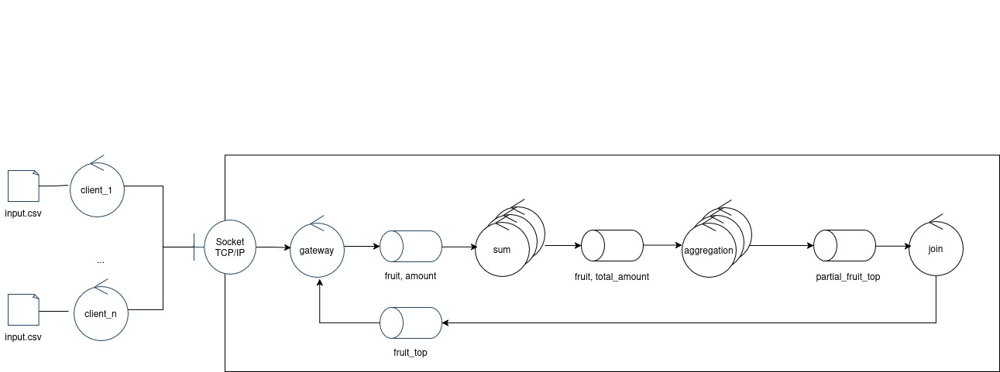

# Trabajo Práctico - Coordinación

En este trabajo se busca familiarizar a los estudiantes con los desafíos de la coordinación del trabajo y el control de la complejidad en sistemas distribuidos. Para tal fin se provee un esqueleto de un sistema de control de stock de una verdulería y un conjunto de escenarios de creciente grado de complejidad y distribución que demandarán mayor sofisticación en la comunicación de las partes involucradas.

---

## Ejecución

- `make up`  
  Inicia los contenedores del sistema y comienza a seguir los logs de todos ellos en un solo flujo de salida.

- `make down`  
  Detiene los contenedores y libera los recursos asociados.

- `make logs`  
  Sigue los logs de todos los contenedores en un solo flujo de salida.

- `make test`  
  Inicia los contenedores del sistema, espera a que los clientes finalicen, compara los resultados con una ejecución serial y detiene los contenedores.

- `make switch`  
  Permite alternar rápidamente entre los archivos de docker compose de los distintos escenarios provistos.

---

## Mi solución

### Protocolo interno

Los mensajes siguen siempre una estructura uniforme:

{
  "type": number,
  "source_client_uuid": "string",
  "data": "Any (generalmente un array conteniendo datos)"
}

Para los tipos de mensajes se utiliza el siguiente formato:

{WorkerOrigen}\_{WorkerDestino}\_{Objetivo}

Por ejemplo:

- GAT_SUM_EOF: mensaje del gateway a los workers sum indicando EOF (end of data sent).

---

### Diseño

En lo que refiere al diseño de robustez, se mantuvo el diseño original. El único cambio es que se agregó una capa de sincronización entre cada instancia de los worker sum para cuando se envía un EOF de datos de un cliente.

*Fig. 1: Diagrama de Robustez Original*

---

### Flujo de mensajería (para un cliente, por simplificación)

- Se envía GAT_SUM_DATA desde el Gateway a la cola de trabajo de los sum.
- Todos los sum van leyendo cada mensaje con cada par (fruta, cantidad).
- En un determinado momento un worker sum recibirá un mensaje GAT_SUM_EOF indicando que finalizó el envío de datos de esa solicitud del cliente.
- Dicho worker sum enviará por un exchange de control un mensaje de tipo SUM_SUM_EOF.
- Los otros sum, al recibir dicho mensaje, entenderán que ha finalizado la carga de datos de ese cliente.
- Ya sea que se reciba GAT_SUM_EOF o SUM_SUM_EOF, se procederá eventualmente a enviar los datos a los aggregators con el mensaje SUM_AGG_DATA.
- Los workers aggregators recibirán dicho mensaje. Estos workers poseen una cola dedicada por cada instancia.
- Cuando el worker sum finaliza de enviar todos los datos del cliente enviará un SUM_AGG_EOF a la cola de cada aggregator.
- Cuando los aggregator reciban un SUM_AGG_EOF equivalente a la cantidad de SUMs existentes, entonces considerarán que finalizó la etapa de agregación y pasarán a enviar un top 3 parcial al join mediante AGG_JOIN_DATA, donde cada mensaje es un dato del top. Cuando finaliza envía AGG_JOIN_EOF.
- El worker join recibirá AGG_JOIN_DATA y finalizará al recibir AGG_JOIN_EOF, enviando el resultado final al gateway con un JOIN_GAT_DATA.

---

## Presuposiciones de la solución

- Un cliente envía una única petición. Se dejó de esa forma. No es complicada la modificación, pero la solución actual no requería resolver esa cuestión en específico.
- En la capa de sincronización... 
- Una vez que se recibe uno de los mensajes de EOF (según el worker que corresponda), dicha instancia pasará a limpiar los datos de ese cliente. No se guarda en memoria nada que no sea estrictamente aquello que se está procesando.
- Una mejora posible sería agregar persistencia en archivos para guardar los datos. No se implementó, pero se consideró.

---

## Consideraciones

- Para asegurar de manera determinista que una fruta de un cliente específico vaya siempre al mismo aggregator, y para a su vez garantizar una distribución no privilegiada hacia ninguna instancia específica, se utilizó hashlib para generar un valor que permita particionar la relación cliente-fruta hacia un aggregator determinado. Inicialmente se utilizó hash() de Python, pero se descartó por no ser determinista (mismos datos iban a diferentes aggregators).

- Ya sea que se reciba GAT_SUM_EOF o SUM_SUM_EOF, la capa de sincronización solo finalizará cuando no haya en proceso ningún otro mensaje GAT_SUM_DATA asociado a ese cliente. Podría ocurrir que se haga flush de la información de un cliente al recibir SUM_SUM_EOF sin haber terminado de procesar un GAT_SUM_DATA. Para evitar este escenario se utiliza una variable inflight_by_client que guarda la cantidad de mensajes en procesamiento. Al recibir EOF se marca eof_by_client[client] = True. Luego, si no quedan mensajes en procesamiento, se finaliza y comienza el envío de datos al aggregator...s
- 